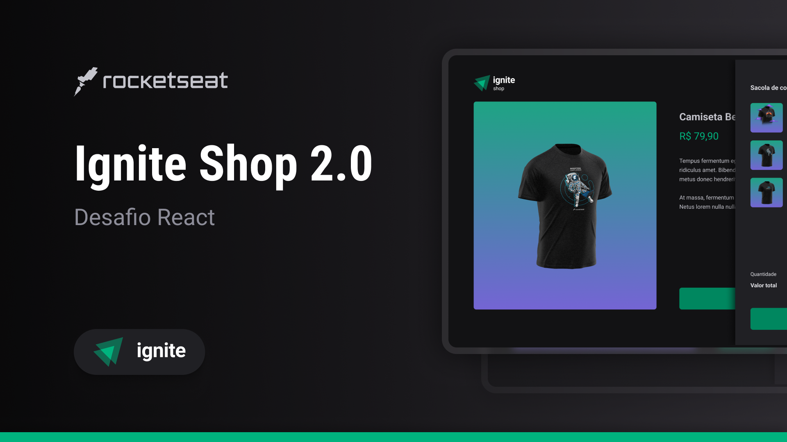

<!-- markdownlint-disable MD033 -->
<!-- markdownlint-disable MD041 -->

   
   
   
   
   
  

 

# `Desafio Ignite React - Ignite Shop v2.0`

[**Sobre o Projeto**](#sobre-o-projeto) &nbsp;&nbsp;&#124;&nbsp;&nbsp;
[**Deploy**](#deploy) &nbsp;&nbsp;&#124;&nbsp;&nbsp;
[**Tecnologias**](#tecnologias) &nbsp;&nbsp;&#124;&nbsp;&nbsp;
[**Layout**](#layout) &nbsp;&nbsp;&#124;&nbsp;&nbsp;
[**Licença**](#licença)

 

  

## Sobre o Projeto

Nesse desafio, você vai aproveitar a aplicação que já desenvolvemos na trilha para implementar um carrinho que utilizará os dados da API do Stripe para buscar os itens existentes, e controlará, através da sua aplicação, o número de itens que a pessoa deseja comprar.

- Você utilizará a listagem já criada pela aplicação, mas adicionará a possibilidade de adicionar aquele item ao carrinho na página do produto.
- Salvar todos os itens selecionados em sua aplicação, e exibir o número de itens no carrinho
- Enviar o carrinho que você armazenou na aplicação para a rota de checkout, onde irá gerar a sessão de checkout com os `line_items` necessários.

## Deploy

Indisponível

## Tecnologias

- [`React`](https://reactnative.dev/)
- [`TypeScript`](https://www.typescriptlang.org/)
- [`NextJs`](https://nextjs.org/)
- [`ESLint`](https://eslint.org/)
- [`Prettier`](https://prettier.io/)
- [`Stitches`](https://stitches.dev/)
- [`Stripe`](https://stripe.com/br)
- [`Axios`](https://axios-http.com/ptbr/)
- [`Keen Slider`](https://keen-slider.io/)

## Layout

Acesse o layout do projeto [`AQUI`](https://www.figma.com/file/3g0CGTQh6ZMRD2cjdl15nw).

É necessário ter uma conta no [Figma](https://figma.com) para acessar os layouts.

## Licença

Distribuído sob a licença **_MIT_**. Veja [LICENSE](LICENSE) para mais informações.

## Autor

Feito com ❤️ por [`Marcel Kaled`](https://github.com/mgckaled/).
